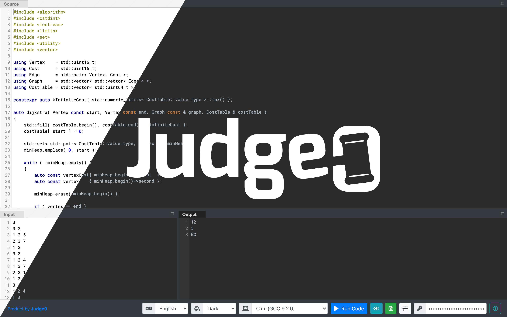
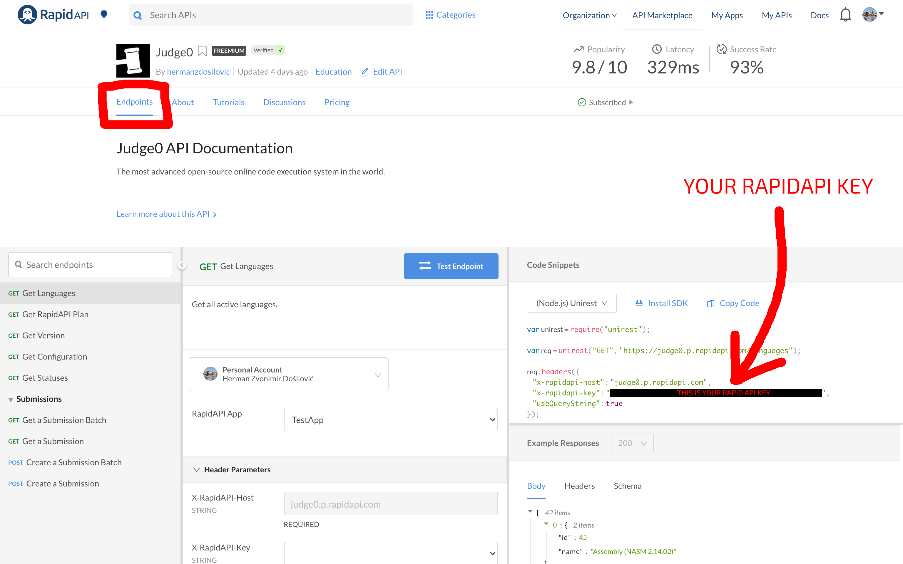
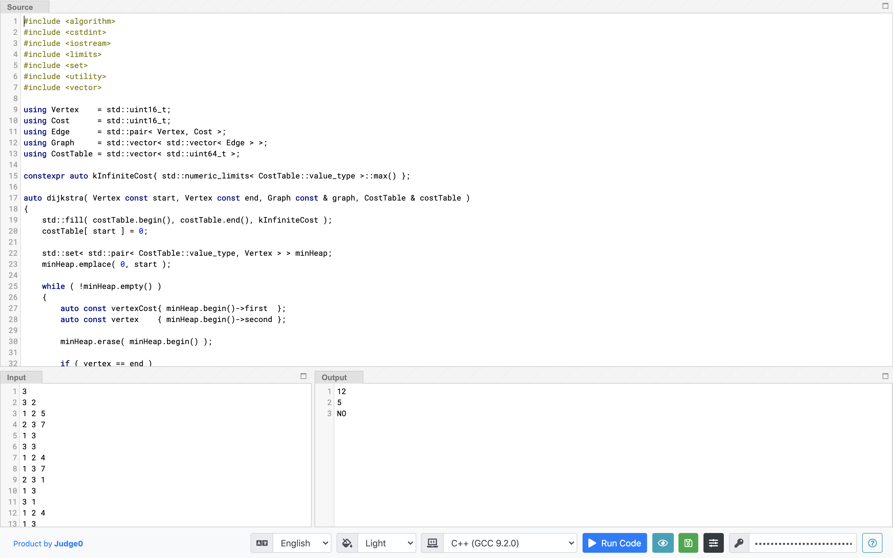
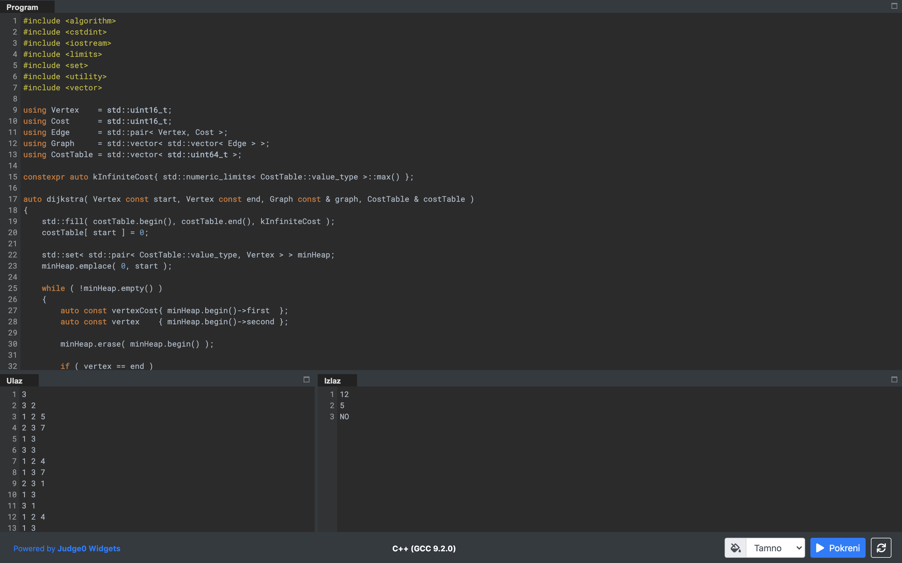
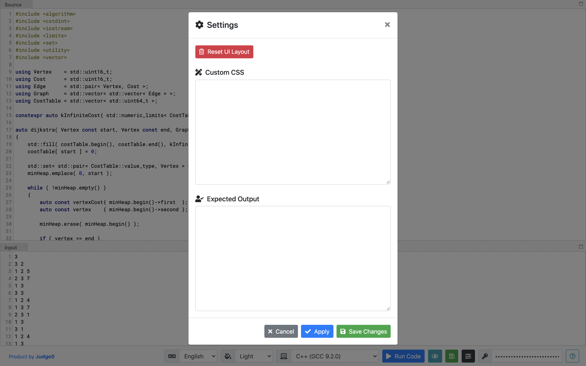
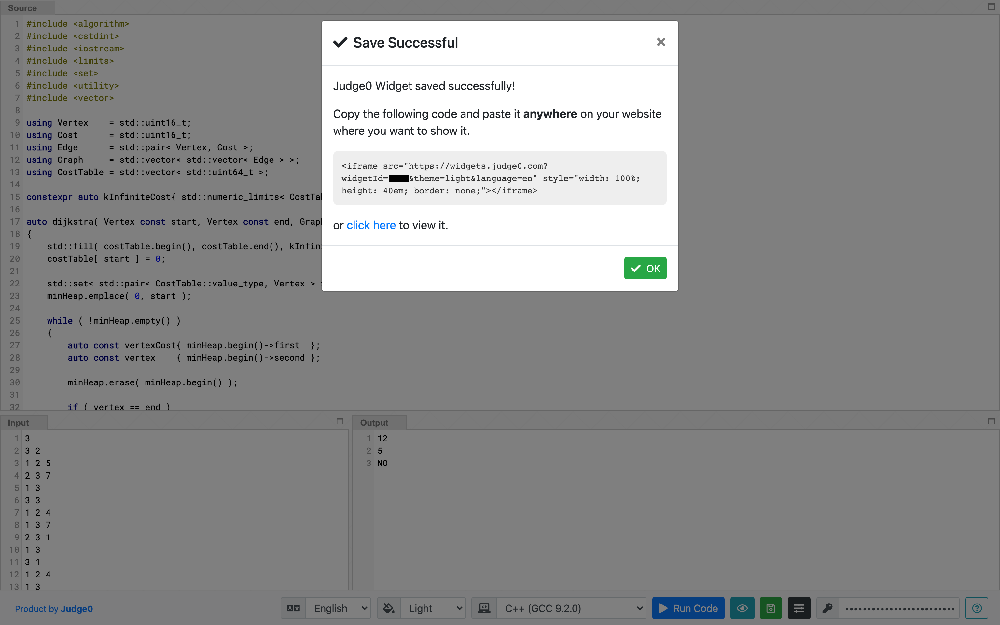
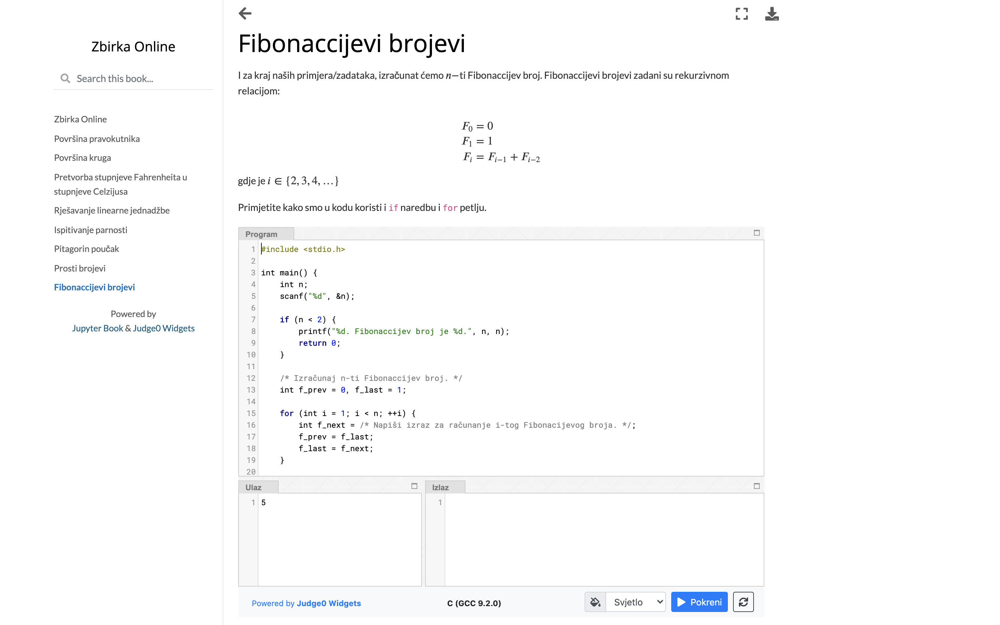

# Judge0 Widgets

😎 Online compiler widgets for your website.

## About
[**Judge0 Widgets**](https://widgets.judge0.com) is a simple, but powerful platform for creating custom online compiler widgets for your website.

## Features
* Support for [60+ languages](https://github.com/judge0/judge0#supported-languages)
* Responsive design
* Easy embedding with the single line of HTML
* Light and dark theme
* Custom and reorderable layout
* Custom CSS and branding
* Optional UI language
* Custom expected output for validating user's code

## Get Started
1. Choose a plan for [Judge0](https://rapidapi.com/hermanzdosilovic/api/judge0/pricing) and/or [Judge0 Extra](https://rapidapi.com/hermanzdosilovic/api/judge0-extra/pricing) (it's **FREE**).
2. Use your RapidAPI key at https://widgets.judge0.com.

## Features for Paid Users
If you are subscribed to a paid plan of at least one flavor of Judge0, you are a paid user.

As a paid user you can set and save *Custom CSS* or *Expected Output* for your Judge0 Widget, but as a basic user, you can just preview these features.

## UI Translations
Do you want to have an option for translating the UI to your native language? Please contribute to this project by translating the values in [en.css](./i18n/en.css).

## FAQ

Click here to expand.

<h3>What are Judge0 and Judge0 Extra?</h3>

<a href="https://rapidapi.com/hermanzdosilovic/api/judge0/pricing">Judge0</a> and <a href="https://rapidapi.com/hermanzdosilovic/api/judge0-extra/pricing">Judge0 Extra</a> are two flavors of the most advanced open-source online code execution system in the world - <a href="https://github.com/judge0/judge0">Judge0</a>.

<h3>What is Judge0 used for?</h3>

Judge0 is used for securely compiling and running the code your users write in the Judge0 Widgets.

<h3>Why do I need to sign up on RapidAPI?</h3>

You need to sign up on RapidAPI and subscribe to <a href="https://rapidapi.com/hermanzdosilovic/api/judge0/pricing">Judge0</a> and/or <a href="https://rapidapi.com/hermanzdosilovic/api/judge0-extra/pricing">Judge0 Extra</a> to get your RapidAPI key which will be used for communicating with the Judge0.

<h3>Where can I find my RapidAPI Key?</h3>

After signing up to RapidAPI, subscribe to <a href="https://rapidapi.com/hermanzdosilovic/api/judge0/pricing">Judge0</a> and/or <a href="https://rapidapi.com/hermanzdosilovic/api/judge0-extra/pricing">Judge0 Extra</a> and visit <a href="https://rapidapi.com/hermanzdosilovic/api/judge0/endpoints"><em>Endpoints</em></a>

<h3>How do I remove Judge0 Widgets branding?</h3>
If you are a paid user you can use the <em>Custom CSS</em> feature that allows you to inject custom CSS into the widget.
<pre><code>#judge0-widgets-copyright {
    display: none;
}
</code></pre>

## Screenshots
Creating a Judge0 Widget with light theme and English UI.

Judge0 Widget with UI translated to Croatian.

Editing Judge0 Widget settings.

Saving Judge0 Widget and getting instructions for embedding.

Judge0 Widget in an online workbook with programming exercises.
